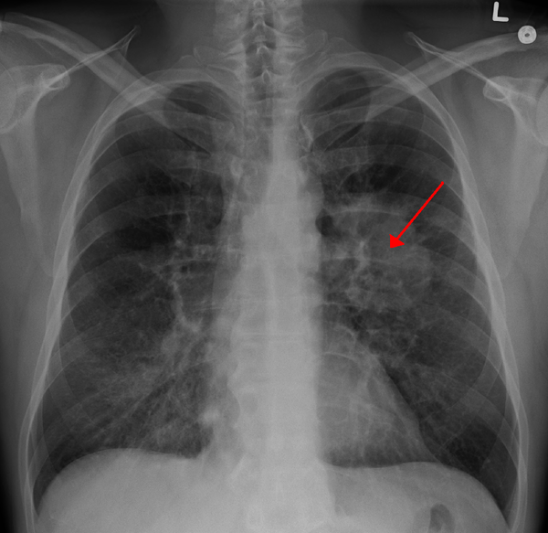

# Data Science Portfolio

Here are some of my best Data Science Projects. I have explored various machine-learning algorithms for different datasets. Feel free to contanct me to learn more about my experience working with these projects.

***
[Predicting a Patient Heart Condition](https://github.com/mikemoore26/Heart_Disease)

- <b>skills used:</b> python,sklearn,logistic Regression,pandas,numpy, pickle
- <b>Quantifiable Result</b>: 94%
- <b>Project Description:</b>: Predicting Heart Disease. Analyze the data set and identify most relevant heart disease related risk factors as well as predict the overall risk.
- Used various logisitic models to find the appropreite model to get more accurate scores 
- Random Forest Gave us the best estimator

***
[Predicting House Pricing Based](https://github.com/mikemoore26/house_Prediction)

- <b>skills used:</b> Python, Sklearn kit, Linear Regression, Pandas,Numpy, Matplotlib, seaborn, accuracy score, model optimization,
- <b>project Description:</b> With 79 explanatory variables describing (almost) every aspect of residential homes in Ames, Iowa, this competition challenges you to predict the final price of each home.
- Practiced data normalization
- Scaled data to make more accurate predictions
- Used various logisitic models to find the appropreite model to get more accurate scores 

- <b>Quantifiable Result:</b> 89%

***

[Examining the effect of environmental factors and weather on Bike rentals](https://github.com/mikemoore26/Linear_Bike)

- <b>skills used:</b> sklearn,pandas,numpy,matplotlib,seaborn,regression

- <b> Project Objective:</b> By predicting the bike rental demand in advance from weather forecast, Bike Rental Company position the bike according to customers demands resulting in increase in bike utilization.
-  
- <b>project Description:</b>Using recorded weather forecasts i trained a model which predict the possible amount of customers would be interested in renting a bike for a particular day
- Used Linear Regression to predict the number of bikes rented in the city of Seoul
- The data had quite a few categorical variables which were encoded for use in the model
- Encoded categorical variables to numeric using Sklearn due to the presence of many string columns
- Fit a multiple linear regression model with high prediction accuracy through iteration

- <b>Quantifiable Result:</b> 88.39%

***

[Identifying Customers Likely to Subscribe for Term Deposit](https://github.com/mikemoore26/banking_membership)

***
- <b> skills Used:</b> Python,Numpy, Pandas, Matplotlib, Seaborn, Smote, Logisitic Regression,

- <b> project Description:</b>In this project you will be provided with real world data which is related with direct marketing campaigns (phone calls) of a Portuguese banking institution.The classification goal is to predict if the client will subscribe a term deposit (variable y).
- Used logistic regression to identify potential bankers based on various attributes.
- Implemented SMOTE to balance class labels.
- Created the confusion matrix for the predictions and make note of the outputs.
- Created a classification report and eplored the various outputs.
- Model had an accuracy score 91.25%.

- <b> Quantifiable Result:</b> 90%

***

[Identifying symptoms of orthopedic patients as normal or abnormal](https://github.com/mikemoore26/Bone_K_Nearest_Neighbor/blob/main/Bone(knn_NB).ipynb)

***

- <b> skills Used:</b>
- <b> project Description:</b>
  -Used the K Nearest Neighbours algorithm to classify a patient's condition as normal or abnormal based on various orthopedic parameters
  - Compared predictive performance by fitting a Naive Bayes model to the data
  - Selected best model based on train and test performance
- <b>Quantifiable Result:</b> 85.95%

## OTHER PROJECTS 
[Lung Cancer Prediction](https://github.com/mikemoore26/Lung_Cancer/blob/main/eda.ipynb)

- Accuracy: 88.7%

[Predicted Car Price based on attributes](https://github.com/mikemoore26/car_price_prediction/blob/main/carprice.ipynb)

***

[TalkingData Ad Fraudulent capture](https://github.com/mikemoore26/talking_data/blob/main/talking_data.ipynb)

****
Accuracy Score: 89.47%
***

[Employee Compensation Clustering ](https://github.com/mikemoore26/employee_compensation/blob/main/EmpCompensation_clustering.ipynb)

[Recognising Handwritten numbers using Neural Networks](https://github.com/mikemoore26/img_to_text)

[Titanic Survivors ](https://github.com/mikemoore26/titanic/blob/main/Titanic.ipynb)

